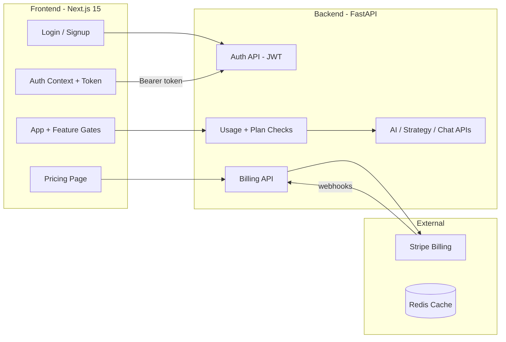

# How to Make Money With Gloomberg (SaaS Monetization)

Gloomberg is an **AI-powered financial research terminal for retail traders** (dashboard, AI chat, asset analysis, strategy lab, AI strategy generator). Below is the refined monetization plan and implementation status.

---

## 1. Monetization Model

**Subscription tiers (freemium) + usage-based caps** — Free tier gets core dashboard + limited AI/backtests; Pro tier gets higher limits, AI strategy generator, and premium features. This aligns costs (OpenAI, compute) with how retail traders pay (e.g. TradingView, Benzinga).

---

## 2. Tier Structure

| | Free | Pro ($24/mo) |
|---|---|---|
| Market dashboard & asset pages | Unlimited | Unlimited |
| AI chat messages | 10/day | 200/day |
| Backtests | 3/day | 50/day |
| AI Strategy Generator | Locked | Unlocked |
| Technical indicators | Basic | All |
| Backtest windows | Up to 2yr | 5yr+ |
| Priority support | — | Yes |

Usage resets daily at midnight UTC. Cancel anytime.

---

## 3. Implementation Status

### Backend (FastAPI)

| Component | File | Status |
|---|---|---|
| Auth service (JWT, passwords, usage, plan limits) | `backend/services/auth.py` | Done (in-memory) |
| Auth API (register, login, /me) | `backend/api/auth.py` | Done |
| Billing API (Stripe checkout, webhook, portal) | `backend/api/billing.py` | Done |
| Usage checks in Chat | `backend/api/chat.py` | Done |
| Usage checks in Strategy/Backtest | `backend/api/strategy.py` | Done |
| Config (JWT secret, Stripe keys) | `backend/config.py` | Done |

### Frontend (Next.js 15)

| Component | File | Status |
|---|---|---|
| Auth context + token management | `frontend/src/lib/auth.tsx` | Done |
| Auth headers in API client | `frontend/src/lib/api.ts` | Done |
| Login/register page | `frontend/src/app/login/page.tsx` | Done |
| Header auth UI (login, user info, plan badge) | `frontend/src/components/TerminalHeader.tsx` | Done |
| Pricing page | `frontend/src/app/pricing/page.tsx` | Done |
| Upgrade modal | `frontend/src/components/UpgradeModal.tsx` | Done |
| Upgrade banner | `frontend/src/components/UpgradeBanner.tsx` | Done |
| Chat upgrade prompts + msg counter | `frontend/src/app/chat/page.tsx` | Done |
| Strategy upgrade prompts + PRO gate | `frontend/src/app/strategy/page.tsx` | Done |

---

## 4. Architecture



---

## 5. To Go Live (Remaining Steps)

1. **Stripe setup** — Create products/prices in Stripe Dashboard, set `STRIPE_SECRET_KEY`, `STRIPE_WEBHOOK_SECRET`, and `STRIPE_PRICE_ID_PRO` in `.env`
2. **Database persistence** — Replace in-memory stores in `services/auth.py` with PostgreSQL (SQLAlchemy models + asyncpg, already in deps)
3. **Email verification** (optional) — Add email confirmation flow
4. **Password reset** (optional) — Add forgot-password / reset flow
5. **Production hardening** — Rotate `JWT_SECRET`, set secure cookie flags, rate limiting, HTTPS

---

## 6. Environment Variables Needed

```env
# Auth
JWT_SECRET=<random-secret-min-32-chars>

# Stripe
STRIPE_SECRET_KEY=sk_live_...
STRIPE_WEBHOOK_SECRET=whsec_...
STRIPE_PRICE_ID_PRO=price_...

# Frontend
NEXT_PUBLIC_API_URL=https://api.yourdomain.com
```
