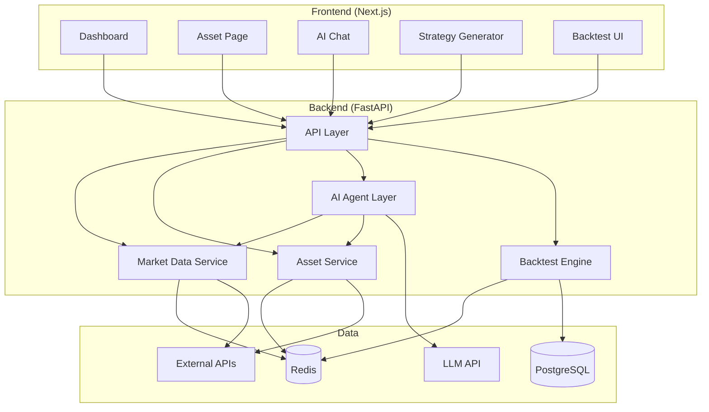

# Gloomberg — System Architecture

## High-Level Architecture

```
┌─────────────────────────────────────────────────────────────────────────────────┐
│                              FRONTEND (Next.js)                                  │
│  ┌─────────────┐ ┌─────────────┐ ┌─────────────┐ ┌─────────────┐ ┌─────────────┐ │
│  │  Dashboard  │ │ Asset Page  │ │ AI Chat     │ │ Strategy    │ │ Backtest    │ │
│  │  (indices,  │ │ (charts,    │ │ (research   │ │ Generator   │ │ Results     │ │
│  │   heatmaps) │ │  news, AI)  │ │  Q&A)       │ │             │ │             │ │
│  └──────┬──────┘ └──────┬──────┘ └──────┬──────┘ └──────┬──────┘ └──────┬──────┘ │
│         │               │               │               │               │        │
│         └───────────────┴───────────────┴───────────────┴───────────────┘        │
│                                    │                                              │
│                         Next.js API Routes / fetch()                              │
└────────────────────────────────────┼─────────────────────────────────────────────┘
                                     │
                                     ▼
┌─────────────────────────────────────────────────────────────────────────────────┐
│                           BACKEND (FastAPI)                                       │
│  ┌─────────────────────────────────────────────────────────────────────────────┐ │
│  │ API LAYER                                                                   │ │
│  │  /api/market/*  /api/assets/*  /api/chat/*  /api/strategies/*  /api/backtest│ │
│  └─────────────────────────────────────────────────────────────────────────────┘ │
│         │                    │                    │                    │         │
│         ▼                    ▼                    ▼                    ▼         │
│  ┌─────────────┐     ┌─────────────┐     ┌─────────────┐     ┌─────────────┐    │
│  │ Market      │     │ Asset       │     │ AI Agent    │     │ Strategy &  │    │
│  │ Data Service│     │ Service     │     │ Layer       │     │ Backtest    │    │
│  │ (cache)     │     │ (charts,    │     │ (LLM +      │     │ Engine      │    │
│  │             │     │  news)      │     │  tools)     │     │             │    │
│  └──────┬──────┘     └──────┬──────┘     └──────┬──────┘     └──────┬──────┘    │
│         │                   │                   │                   │          │
└─────────┼───────────────────┼───────────────────┼───────────────────┼──────────┘
          │                   │                   │                   │
          ▼                   ▼                   ▼                   ▼
┌─────────────────────────────────────────────────────────────────────────────────┐
│  DATA LAYER                                                                      │
│  ┌─────────────┐     ┌─────────────┐     ┌─────────────┐     ┌─────────────┐    │
│  │ Redis       │     │ PostgreSQL  │     │ External    │     │ LLM API     │    │
│  │ (quotes,    │     │ (users,     │     │ Market APIs │     │ (OpenAI/    │    │
│  │  cache)     │     │  strategies)│     │ (Yahoo, AV) │     │  compatible)│    │
│  └─────────────┘     └─────────────┘     └─────────────┘     └─────────────┘    │
└─────────────────────────────────────────────────────────────────────────────────┘
```

## Component Interactions

| Component | Responsibility | Depends On |
|-----------|----------------|------------|
| **API Layer** | REST endpoints, validation, auth (optional for MVP) | All services below |
| **Market Data Service** | Fetch/cache indices, gainers, losers, sectors, crypto | Redis, Yahoo/Alpha Vantage |
| **Asset Service** | OHLCV, news, stats for a ticker | Market data, external APIs |
| **AI Agent Layer** | Answer questions, generate summaries, suggest strategies | LLM API, Market/Asset services |
| **Strategy & Backtest Engine** | Run rules on history, compute metrics | PostgreSQL (optional cache), price data |

## Data Flow Examples

1. **AI Market Research (e.g. "Why is the market down?")**  
   Client → `/api/chat` → AI Agent → tools: get_market_overview(), get_top_movers(), get_news() → LLM → response.

2. **Asset Analysis (e.g. AAPL)**  
   Client → `/api/assets/AAPL` → Asset Service → market data + news → optional AI summary → response.

3. **Strategy + Backtest**  
   Client → `/api/strategies/generate` (optional) or submit rule → `/api/backtest` → Backtest Engine → historical data → metrics + equity curve → response.

4. **Dashboard**  
   Client → `/api/market/dashboard` → Market Data Service → Redis cache or live fetch → aggregates → response.

## Mermaid Diagram (for rendering)


